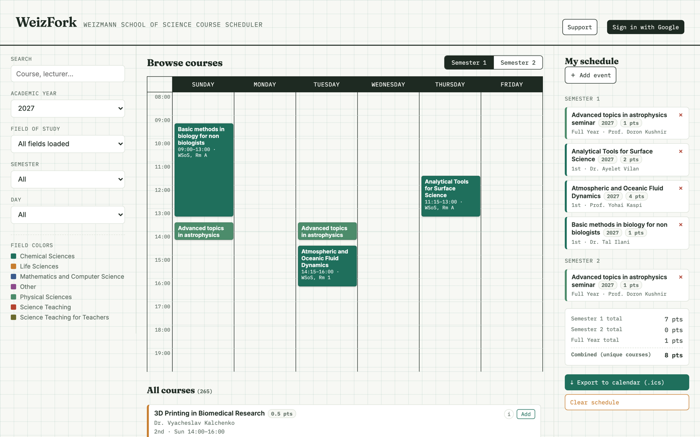
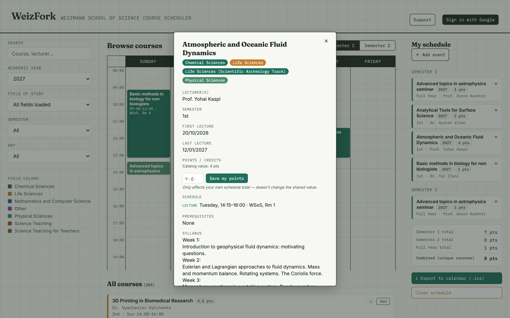
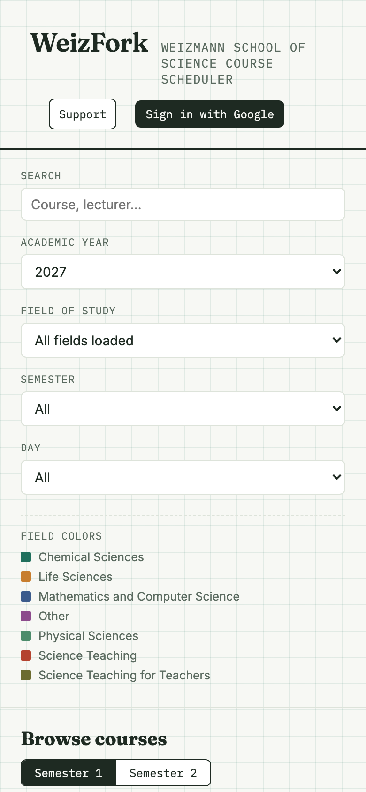

# WeizFork

**A course browser and weekly-schedule planner for the Weizmann School of Science.**

Browse the real WSoS course catalog, build a conflict-free weekly schedule by
clicking around a calendar, track your credit points, and export the whole
thing straight to your own calendar app — no spreadsheets, no digging
through the official course search page one field at a time.

**[→ Open WeizFork](https://bahat.github.io/weizfork/)**

*Independent project, not affiliated with the Weizmann Institute of Science.
Data is scraped from the public course catalog — always double-check
against the official system before registering.*

---

## What you can do with it

- **Browse & filter** the full catalog — by academic year (2023–2027), field
  of study, semester, or day of the week — instead of re-running the same
  search on the official site over and over.
- **See your week at a glance.** Add a course and it drops straight onto a
  visual weekly calendar; overlapping sessions are outlined in red so
  conflicts jump out immediately.
- **Cross-listed courses shown properly.** A course offered under multiple
  fields of study shows every one of them, so filtering by field never
  hides a course that belongs there.
- **Points, tracked automatically.** Each course's credit points feed into
  running totals for Semester 1, Semester 2, and Full-Year courses, plus a
  combined total — no more adding it up by hand.
- **The details you actually need**, in one place: lecturer(s), schedule,
  prerequisites, syllabus, and learning outcomes, pulled straight from each
  course's official page.
- **Add your own events**, too — a private lesson, a lab meeting, anything
  that isn't in the official catalog — right alongside your real courses on
  the same calendar. Only visible to you.
- **Export to your calendar.** Pick exactly which courses to include and
  download a `.ics` file that opens directly in Google Calendar, Apple
  Calendar, Outlook, or anything else.
- **Sign in with Google** to save your schedule across devices, leave a
  quick anonymous review for a course, and record your own personal point
  values for courses the catalog hasn't listed points for yet.

## A closer look

Every course's info popup shows exactly what you'd want before deciding to
take it — which fields it's cross-listed under, the full weekly schedule,
prerequisites, and the syllabus, without a single extra click on the
official site.

Works just as well on a phone as it does on a laptop — browse, filter, and
manage your schedule from anywhere.

## Getting started

1. Open **[bahat.github.io/weizfork](https://bahat.github.io/weizfork/)**.
2. Pick your academic year and filter down to the courses you care about.
3. Click **Add** on anything you want — it appears on the calendar and in
   "My schedule" immediately.
4. **Sign in with Google** (top right) if you want your schedule saved for
   next time, or to leave a review.
5. When you're happy with your schedule, hit **Export to calendar** and
   import the `.ics` file wherever you keep your real calendar.

No account is required just to browse and build a schedule for the current
session — signing in only matters if you want it to persist.

---

Curious how it's built, or want to run/host your own copy? See
[`TECHNICAL.md`](TECHNICAL.md) for the setup guide, or
[`PROJECT_CONTEXT.md`](PROJECT_CONTEXT.md) for engineering/architecture notes.
